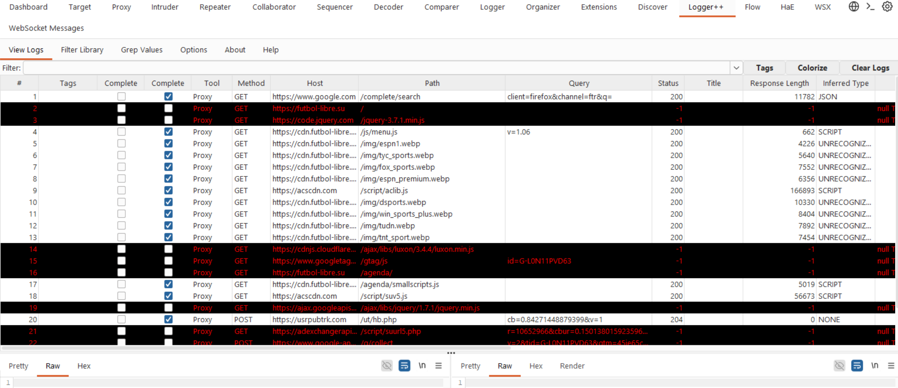

# Sesión S01 — Informe de análisis técnico
## Navegación pasiva controlada

---

## 1. Resumen ejecutivo

La presente sesión experimental tuvo como finalidad observar el comportamiento técnico generado durante una navegación pasiva controlada sobre el dominio objetivo, sin interacción deliberada del usuario.

Durante la sesión se identificaron múltiples comunicaciones automáticas con infraestructura externa, incluyendo servicios analíticos, redes publicitarias, bibliotecas de terceros y mecanismos de telemetría conductual.

El análisis evidenció actividad recurrente hacia endpoints externos, incluyendo comunicaciones compatibles con seguimiento conductual, recolección de atributos del entorno cliente y validación del entorno de ejecución.

---

## 2. Objetivo analítico

Analizar el comportamiento técnico observable generado durante una sesión de navegación pasiva controlada, con el propósito de identificar comunicaciones automáticas, dependencias de terceros, mecanismos de seguimiento, patrones de telemetría y exposición de metadatos del entorno cliente.

Preguntas que orientan esta sesión:

- ¿Qué comunicaciones se generan automáticamente durante la carga inicial del sitio?
- ¿Qué dominios externos participan en la sesión?
- ¿Existen mecanismos de seguimiento sin interacción explícita del usuario?
- ¿Se transmiten atributos del entorno cliente?
- ¿Se observan mecanismos de validación del navegador o detección de automatización?

---

## 3. Evidencia recolectada

| Artefacto | Descripción |
|---------|-------------|
| `trafico_proxy.pcapng` | Captura completa de tráfico de red |
| `burp_http_history.json` | Historial HTTP/HTTPS exportado desde Burp Suite |
| `logger_timeline.log` | Registro cronológico de solicitudes |
| `screenshots/` | Evidencia visual de la sesión |
| `notas_sesion.md` | Observaciones operativas |

---

## 4. Hallazgos observacionales

La presente sección documenta los hallazgos empíricos observados durante la sesión experimental pasiva, a partir de la correlación entre registros HTTP/HTTPS capturados mediante Burp Suite, cronología de eventos en Logger++, evidencia de red obtenida mediante Wireshark y observación directa del entorno cliente.

Los hallazgos se presentan priorizando observaciones verificables antes de cualquier interpretación analítica.

---

### 4.1 Infraestructura observada

Durante la sesión experimental se identificó un ecosistema técnico distribuido compuesto por infraestructura principal, servicios de terceros y tráfico instrumental generado por el navegador.

La evidencia observada indica que la carga del sitio no depende exclusivamente del dominio principal, sino de múltiples servicios externos involucrados en la entrega de contenido, analítica, publicidad y telemetría.

**Evidencia visual:**  
`06_burp_sitemap.png`

---

#### 4.1.1 Infraestructura principal

Se identificó la siguiente infraestructura directamente asociada al sitio observado:

- `futbol-libre.su`
- `cdn.futbol-libre.su`

El dominio principal fue responsable de la entrega del documento HTML inicial y rutas funcionales observadas durante la sesión, mientras que el subdominio CDN participó en la distribución de recursos estáticos como imágenes, hojas de estilo y scripts.

---

#### 4.1.2 Infraestructura de terceros

Se observaron múltiples comunicaciones automáticas con servicios externos pertenecientes a terceros.

##### Librerías y recursos públicos

Servicios utilizados para carga funcional del frontend:

- `code.jquery.com`
- `cdnjs.cloudflare.com`
- `ajax.googleapis.com`

---

##### Analítica y etiquetado

Servicios asociados a instrumentación analítica:

- `www.googletagmanager.com`
- `www.google-analytics.com`

---

##### Publicidad, monetización y tracking

Servicios observados durante la sesión:

- `usrpubtrk.com`
- `adexchangerapid.com`
- `acscdn.com`

---

##### Navegación previa

Infraestructura asociada al acceso inicial:

- `www.google.com`

---

##### Tráfico instrumental del navegador

Se observaron solicitudes generadas automáticamente por Firefox:

- `incoming.telemetry.mozilla.org`
- `detectportal.firefox.com`
- `aus5.mozilla.org`

Estos eventos corresponden al comportamiento del navegador y fueron diferenciados del tráfico inducido por el sitio analizado.

---

### 4.2 Correlación dominio – infraestructura IP

El análisis de tráfico de red permitió identificar la infraestructura IP observada durante la sesión experimental.

Las direcciones registradas corresponden específicamente a las resoluciones observadas durante la ventana experimental y pueden variar debido al uso de CDN, balanceadores de carga o infraestructura distribuida.

**Evidencia visual:**  
`09_wireshark_conversations.png`

| Nombre de dominio          | IP observada durante la sesión | Clasificación preliminar     |
| -------------------------- | ------------------------------ | ---------------------------- |
| `futbol-libre.su`          | `185.254.197.23`               | dominio principal            |
| `cdn.futbol-libre.su`      | `152.233.22.100`               | CDN asociado                 |
| `acscdn.com`               | `104.18.17.201`                | infraestructura publicitaria |
| `cdnjs.cloudflare.com`     | `104.17.24.14`                 | librería externa             |
| `www.googletagmanager.com` | `142.250.78.104`               | etiquetado analítico         |
| `ajax.googleapis.com`      | `172.217.29.106`               | librería externa             |
| `usrpubtrk.com`            | `104.21.92.33`                 | tracking / telemetría        |
| `adexchangerapid.com`      | `172.67.222.246`               | publicidad / monetización    |
| `www.google-analytics.com` | `142.250.79.206`               | analítica                    |
| `www.google.com`           | `142.251.151.119`              | navegación previa            |
| `code.jquery.com`          | `151.101.2.137`                | librería externa             |

La correlación observada evidencia participación activa de múltiples actores externos durante la sesión.

---

### 4.3 Flujo HTTP observado

El historial HTTP capturado permitió reconstruir el flujo funcional observado durante la sesión.

**Evidencia visual:**  
`02_burp_http_history.png`  
`03_loggerpp_timeline.png`

Secuencia observada:

1. acceso inicial mediante búsqueda web
2. solicitud del documento HTML principal
3. carga de recursos estáticos asociados al dominio principal
4. carga de librerías externas
5. inicialización de scripts analíticos
6. comunicación automática con servicios publicitarios
7. generación de solicitudes POST automáticas hacia infraestructura externa
8. actividad recurrente durante toda la ventana experimental

No se observó interacción manual deliberada posterior durante la sesión.

---

### 4.4 Actividad recurrente observada

El análisis agregado de flujo permitió identificar endpoints con comportamiento repetitivo durante la sesión experimental.

**Evidencia visual:**  
`07_burp_flow.png`

| Endpoint observado | Método | Frecuencia observada | Clasificación preliminar |
|-------------------|--------|---------------------|--------------------------|
| `www.google-analytics.com/g/collect` | POST | 26 eventos | analítica |
| `usrpubtrk.com/ut/hb.php` | POST | recurrente | tracking conductual |
| `adexchangerapid.com/script/suurl5.php` | GET | 16 eventos | infraestructura publicitaria |
| `www.googletagmanager.com/gtag/js` | GET | observado | etiquetado analítico |

La recurrencia observada indica actividad automatizada sostenida durante la sesión, incluso en ausencia de interacción explícita del usuario.

---

### 4.5 Payloads relevantes observados

Se identificó un payload JSON transmitido automáticamente hacia infraestructura externa correspondiente a `usrpubtrk.com`.

**Evidencia visual:**  
`04_usrpubtrk_request.png`

El contenido observado incluía variables asociadas a comportamiento del usuario, contexto de navegación y atributos del entorno cliente.

---

#### 4.5.1 Variables conductuales observadas

Campos identificados:

- `sessionLength`
- `totalClicks`
- `isScrolled`
- `isMouseMoved`
- `pagePercentageSeen`
- `isTabFocused`
- `isFullscreen`

---

#### 4.5.2 Variables contextuales observadas

Campos identificados:

- `pUrl`
- `pTitle`
- `pDescription`
- `pReferrer`

---

#### 4.5.3 Variables del entorno cliente

Campos identificados:

- `vWidth`
- `vHeight`
- `pWidth`
- `pHeight`
- `timeZoneOffset`
- `ufp`

---

#### 4.5.4 Validación del entorno

Campo estructurado observado:

- `bsd`

El contenido asociado evidenció información relacionada con consistencia del entorno cliente y atributos del navegador.

---

### 4.6 Respuestas observadas

El endpoint observado respondió con un patrón consistente con recepción de eventos automatizados.

**Evidencia visual:**  
`05_usrpubtrk_response.png`

Endpoint observado:

`usrpubtrk.com/ut/hb.php`

Respuesta observada:

- HTTP/2 `204 No Content`
- `Access-Control-Allow-Origin: *`
- infraestructura servida mediante Cloudflare

No se observó devolución de contenido visible asociado al request.

---

### 4.7 Indicadores cuantitativos preliminares

Durante la sesión experimental se observaron los siguientes indicadores:

- múltiples dominios externos involucrados
- múltiples conexiones HTTPS simultáneas
- 26 eventos hacia Google Analytics
- 16 solicitudes hacia infraestructura publicitaria
- múltiples eventos recurrentes hacia tracking de terceros
- ejecución automática de múltiples scripts externos

Estos indicadores describen el comportamiento observable documentado durante la sesión pasiva.

---
## 5. Análisis interpretativo

La presente sección desarrolla una interpretación técnica de los hallazgos observacionales documentados en la sesión experimental, a partir de la correlación entre tráfico HTTP/HTTPS, payloads observados, actividad de red y comportamiento temporal de las comunicaciones registradas.

A diferencia de la sección anterior, el presente análisis incorpora inferencias técnicas razonables derivadas de la evidencia empírica observada.

---

### 5.1 Tracking conductual

El análisis del payload transmitido hacia infraestructura externa (`usrpubtrk.com`) evidencia la recolección automatizada de variables asociadas al comportamiento observable del usuario durante la sesión.

**Evidencia visual:**  

Entre los indicadores observados se incluyen:

- duración acumulada de sesión (`sessionLength`)
- porcentaje de contenido visualizado (`pagePercentageSeen`)
- eventos de scroll (`isScrolled`)
- foco activo de pestaña (`isTabFocused`)
- eventos de interacción (`totalClicks`)
- movimiento del cursor (`isMouseMoved`)
- estado de pantalla completa (`isFullscreen`)

La naturaleza de estas variables sugiere un mecanismo orientado al monitoreo del comportamiento de navegación del lado cliente.

Particularmente relevante resulta que esta actividad fue observada bajo condiciones de navegación pasiva, sin interacción manual deliberada posterior al acceso inicial.

Este hallazgo indica que la observación de actividad conductual no depende necesariamente de acciones explícitas del usuario, sino que puede iniciarse automáticamente durante la permanencia en la página.

---

### 5.2 Fingerprinting del entorno cliente

Además de variables conductuales, el payload observado incluyó atributos técnicos del entorno cliente que permiten caracterizar de forma relativamente específica el navegador y el contexto de ejecución.

Variables observadas:

- plataforma del sistema (`Win32`)
- resolución de pantalla
- dimensiones del viewport
- idioma del navegador
- zona horaria
- atributos consolidados del navegador (`ufp`)
- dimensiones del documento renderizado

Estas variables constituyen señales técnicas frecuentemente utilizadas para caracterización del entorno cliente.

La combinación de múltiples atributos incrementa la granularidad del perfil técnico observable, permitiendo diferenciar navegadores, configuraciones y entornos con mayor precisión que mediante identificadores individuales aislados.

No se observó evidencia suficiente para afirmar fingerprinting persistente avanzado a nivel criptográfico o basado en canvas hashing; sin embargo, sí se identificaron atributos compatibles con perfilado técnico del cliente.

---

### 5.3 Validación anti-automatización

El análisis del campo estructurado `bsd`, incluido dentro del payload transmitido hacia infraestructura externa, evidencia mecanismos orientados a validación del entorno cliente y detección de automatización.

Indicadores observados:

- presencia o ausencia de WebDriver
- detección de Chrome DevTools Protocol (CDP)
- validación de artefactos asociados a navegadores automatizados
- consistencia del entorno navegador
- verificación de WebRTC
- indicadores asociados a comportamiento sospechoso de entrada

Estos controles son consistentes con mecanismos comúnmente utilizados para distinguir tráfico humano de entornos automatizados, herramientas de scraping o navegadores instrumentados.

La presencia de estos indicadores sugiere que el entorno cliente no solo es observado pasivamente, sino también evaluado en términos de consistencia operativa.

---

### 5.4 Dependencia de infraestructura de terceros

La sesión evidenció una arquitectura fuertemente distribuida, en la cual el funcionamiento observable del sitio depende de múltiples servicios externos.

**Evidencia visual:**  
`06_burp_sitemap.png`  
`07_burp_flow.png`

Infraestructura observada:

- bibliotecas JavaScript externas
- servicios de analítica
- redes publicitarias
- endpoints de telemetría
- infraestructura CDN
- etiquetado analítico

Esta dependencia introduce múltiples superficies de interacción entre el cliente y terceros ajenos al dominio principal.

Desde una perspectiva técnica, este modelo incrementa:

- complejidad operativa
- superficie de observación externa
- dependencia de componentes externos
- número de actores con visibilidad parcial del comportamiento del cliente

---

### 5.5 Exposición de privacidad

Durante la sesión experimental se observó transmisión automática de metadatos asociados al contexto de navegación y características del entorno cliente.

Información observada:

- URL visitada
- título del documento
- descripción del contenido
- atributos del navegador
- dimensiones del viewport
- zona horaria
- comportamiento observable de navegación
- duración de sesión
- estado de interacción

La exposición de esta información hacia infraestructura de terceros implica transferencia de metadatos potencialmente útiles para analítica, segmentación, monitoreo de sesión o correlación de actividad.

Es importante señalar que la presente sesión no evaluó mecanismos persistentes de identificación longitudinal (por ejemplo, cookies persistentes o correlación multi-sesión), por lo que las conclusiones se limitan estrictamente a la exposición observable dentro de la ventana experimental documentada.

---

## 6. Limitaciones de la sesión

La presente sesión presenta las siguientes limitaciones:

- corresponde a una única ejecución experimental
- fue ejecutada en entorno virtualizado controlado
- se utilizó un único navegador
- el comportamiento puede variar según región o momento
- la navegación fue pasiva, sin interacción activa
- parte del tráfico observado corresponde a comportamiento instrumental del navegador

---

## 7. ## 6. Hallazgo preliminar

### Resumen de hallazgos observados

| Categoría                   | Evidencia observada                                                | Interpretación preliminar      |
| --------------------------- | ------------------------------------------------------------------ | ------------------------------ |
| Telemetría automática       | POST recurrentes a `usrpubtrk.com`                                 | monitoreo automático de sesión |
| Analítica                   | 26 eventos hacia `google-analytics.com`                            | seguimiento analítico          |
| Tracking conductual         | variables como `sessionLength`, `pagePercentageSeen`, `isScrolled` | observación de comportamiento  |
| Fingerprinting técnico      | `ufp`, resolución, idioma, viewport, timezone                      | perfilado del entorno cliente  |
| Anti-automatización         | campo `bsd` con señales de WebDriver/CDP                           | validación del entorno         |
| Infraestructura third-party | múltiples dominios externos observados                             | dependencia de terceros        |
| Publicidad                  | `adexchangerapid.com`, `acscdn.com`                                | monetización / ad-tech         |

---

### Indicadores clave de la sesión

| Indicador | Valor observado |
|---------|----------------|
| Duración experimental | 5 min 17 s |
| Google Analytics events | 26 |
| Requests a infraestructura publicitaria | 16+ |
| Endpoints de tracking observados | múltiples |
| Dominios externos involucrados | múltiples |
| Interacción manual deliberada | no |

---

### Hallazgo principal

Incluso bajo condiciones de navegación pasiva, el sitio inicia automáticamente comunicaciones con múltiples servicios externos.

Se observaron mecanismos compatibles con:

- seguimiento conductual
- telemetría del lado cliente
- perfilado técnico del navegador
- validación del entorno de ejecución
- exposición de metadatos hacia terceros

---

### Implicación para sesiones posteriores

Esta sesión establece una **línea base experimental** del comportamiento observable sin interacción activa.

Servirá como referencia comparativa para:

- sesiones con clics
- interacción con reproductores
- navegación extendida
- activación de anuncios o popups
- comportamiento inducido por acciones del usuario

---