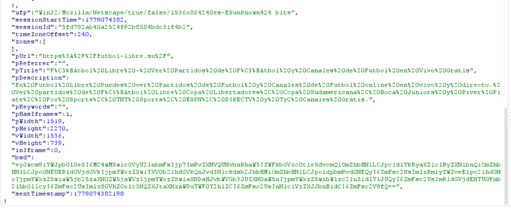

## H-01 Recolección de telemetría conductual hacia infraestructura third-party

### Evidencia observada

Durante la sesión experimental se observó transmisión activa de telemetría conductual desde el navegador del usuario hacia infraestructura third-party perteneciente al dominio:

```text
usrpubtrk.com
```

mediante solicitudes HTTP POST dirigidas al endpoint:

```http
POST /ut/hb.php
```

La solicitud fue generada desde el contexto del dominio analizado:

```text
https://futbol-libre.su
```

y transmitida mediante comunicación cross-site.

---

### Evidencia visual


---

### Evidencia técnica

#### Request observado

```http
POST /ut/hb.php?cb=0.47341770031711394&v=1 HTTP/2
Host: usrpubtrk.com
Origin: https://futbol-libre.su
Referer: https://futbol-libre.su/
Sec-Fetch-Site: cross-site
Sec-Fetch-Mode: no-cors
Content-Type: text/plain; charset=utf-8
```

Payload observado:

```json
{
  "isScrollable": 1,
  "totalClicks": 0,
  "sessionLength": 60,
  "visible": 1,
  "isFullscreen": 0,
  "isTabFocused": 1,
  "isScrolled": 1,
  "isMouseMoved": 1,
  "pagePercentageSeen": 33,
  "sessionId": "5fd792ab40a2524f92b8584bdc31f4b2",
  "timeZoneOffset": 240,
  "pUrl": "https://futbol-libre.su/",
  "pTitle": "Fútbol Libre...",
  "pDescription": "...",
  "pHasIframes": 1,
  "pWidth": 1519,
  "pHeight": 2270,
  "vWidth": 1536,
  "vHeight": 739,
  "ufp": "Win32/Mozilla/Netscape/...",
  "sentTimestamp": 1779074442222
}
```

---

### Atributos observados

La telemetría incluye múltiples dimensiones de observación del usuario y del entorno técnico.

**Comportamiento del usuario**
- scroll detectado
- movimiento del mouse
- foco activo de pestaña
- visibilidad de ventana
- duración de sesión
- porcentaje de página visualizado
- total de clics
- estado fullscreen

**Contexto del documento**
- URL visitada
- título del documento
- descripción del contenido
- presencia de iframes

**Atributos técnicos del entorno**
- resolución de pantalla
- dimensiones del viewport
- zona horaria
- plataforma del navegador
- atributos técnicos utilizables para fingerprinting

**Persistencia**
- identificador de sesión:

```text
sessionId=5fd792ab40a2524f92b8584bdc31f4b2
```

---

### Respuesta observada

```http
HTTP/2 204 No Content
Date: Mon, 18 May 2026 03:20:43 GMT
Server: cloudflare
Access-Control-Allow-Origin: *
Cf-Cache-Status: DYNAMIC
```

---

### Evidencia visual


---

### Observaciones relevantes

#### HTTP 204 No Content

La respuesta:

```http
HTTP/2 204 No Content
```

indica recepción y procesamiento exitoso del evento sin retorno funcional visible al navegador.

Este patrón es consistente con mecanismos de beaconing o telemetría asíncrona orientados exclusivamente a la recepción de eventos.

---

#### Comunicación cross-origin permitida

La presencia de:

```http
Access-Control-Allow-Origin: *
```

confirma aceptación explícita de solicitudes cross-origin.

Dado que la solicitud fue originada desde:

```text
https://futbol-libre.su
```

y enviada hacia:

```text
usrpubtrk.com
```

se confirma transmisión activa de datos hacia infraestructura third-party.

---

#### Infraestructura intermediada

El encabezado:

```http
Server: cloudflare
```

indica que la infraestructura observada se encuentra protegida o intermediada mediante servicios CDN/proxy.

Esto no altera la observación funcional del mecanismo de telemetría.

---

### Interpretación técnica

La evidencia observada es consistente con un mecanismo de telemetría conductual activa (*behavioral telemetry / heartbeat tracking*) operado desde infraestructura third-party.

No se trata únicamente de analítica básica de visitas, sino de instrumentación continua del comportamiento del usuario y del contexto técnico del navegador.

Indicadores relevantes incluyen:

#### Telemetría tipo heartbeat

El endpoint:

```text
/ut/hb.php
```

presenta características consistentes con mecanismos de reporte periódico de estado de sesión.

---

#### Perfilado conductual

La combinación de atributos:

```text
isScrolled
isMouseMoved
pagePercentageSeen
isTabFocused
visible
sessionLength
```

permite inferir engagement, atención y comportamiento interactivo del usuario.

---

#### Recolección de atributos utilizables para fingerprinting

La presencia del campo:

```text
ufp
```

junto con:

- resolución
- plataforma
- zona horaria
- viewport
- navegador

permite individualización técnica pseudónima del navegador.

---

#### Exposición a terceros

La información observada no permanece únicamente dentro del dominio principal, sino que es transferida a infraestructura third-party mediante comunicación cross-site.

---

### Impacto observado

**Privacidad**
- perfilado conductual del usuario
- correlación de sesiones
- exposición de metadata contextual

**Riesgo técnico**
- individualización técnica del navegador
- ampliación de superficie de observación third-party
- persistencia de identificadores de sesión

**Relevancia para la investigación**
Este hallazgo evidencia exposición del usuario a mecanismos de observación conductual de alta granularidad operados fuera del dominio principal.

---

### Limitaciones

No se confirmó mediante esta observación:

- identidad del operador final del dominio
- persistencia longitudinal entre múltiples sesiones
- correlación efectiva entre sesiones distintas
- vinculación con identidad nominal del usuario
-
En consecuencia, el hallazgo documenta capacidad observada de recolección y exposición técnica, no atribución completa del ecosistema de procesamiento.

---

### Recolección de atributos técnicos utilizables para individualización pseudónima

Además de la telemetría conductual observada, el mismo mecanismo transmite atributos técnicos del navegador y del entorno cliente hacia infraestructura third-party.

#### Evidencia técnica

En el payload interceptado se identificaron atributos como:

```json
{
  "ufp": "Win32/Mozilla/Netscape/true/false/1536x864240es-ESunknown424 bits",
  "sessionId": "5fd792ab40a2524f92b8584bdc31f4b2",
  "timeZoneOffset": 240,
  "pWidth": 1519,
  "pHeight": 2270,
  "vWidth": 1536,
  "vHeight": 739,
  "inIframe": 0
}
```

Asimismo, el request incorpora metadatos observables del navegador:

```http
User-Agent: Mozilla/5.0 (Windows NT 10.0; Win64; x64; rv:150.0) Gecko/20100101 Firefox/150.0
Accept-Language: es-ES,es;q=0.9,en-US;q=0.8,en;q=0.7
```

---

### Evidencia visual



---

### Interpretación técnica

La evidencia observada muestra transmisión de múltiples atributos técnicos del entorno cliente que, en combinación, permiten diferenciar técnicamente sesiones de navegación dentro de infraestructura third-party.

Aunque la evidencia no permite afirmar de forma concluyente la generación de un identificador criptográfico único de fingerprinting, sí demuestra exposición de atributos comúnmente utilizados para individualización técnica pseudónima.

#### Indicadores relevantes

##### Contexto técnico del entorno cliente

El atributo:

```text
ufp
```

contiene una concatenación estructurada de propiedades del navegador y del dispositivo, incluyendo:

- plataforma (`Win32`)
- familia del navegador
- dimensiones de pantalla
- idioma del sistema
- arquitectura del entorno

Este comportamiento es consistente con mecanismos de perfilado técnico del cliente.

---

##### Características de renderizado

Los campos:

```text
pWidth
pHeight
vWidth
vHeight
```

permiten identificar:

- dimensiones del documento renderizado
- tamaño del viewport efectivo
- contexto de visualización del navegador

Estas variables reducen uniformidad entre clientes y aumentan capacidad de diferenciación técnica.

---

##### Contexto geotemporal

El atributo:

```text
timeZoneOffset
```

expone información contextual del entorno del usuario que puede complementar procesos de correlación técnica entre eventos.

---

##### Persistencia de sesión

La presencia de:

```text
sessionId
```

indica mantenimiento de identificadores pseudónimos asociados a la sesión observada.

Esto incrementa capacidad de correlación entre eventos transmitidos durante una misma interacción.

---

##### Contexto de ejecución

El atributo:

```text
inIframe
```

evidencia conciencia del contexto de ejecución del navegador, indicando si la sesión ocurre dentro de contenido embebido o contexto principal.

---

### Impacto observado (ampliado)

Además de la observación conductual previamente documentada, esta exposición incrementa:

**Riesgo de individualización técnica**
- diferenciación pseudónima entre navegadores
- enriquecimiento de perfiles técnicos

**Riesgo de correlación**
- asociación entre comportamiento y características del entorno cliente
- correlación de múltiples eventos dentro de la misma sesión

**Relevancia para la investigación**
Este hallazgo evidencia que la exposición del usuario no se limita a observación conductual, sino que incluye transmisión estructurada de atributos técnicos del navegador hacia infraestructura third-party.
