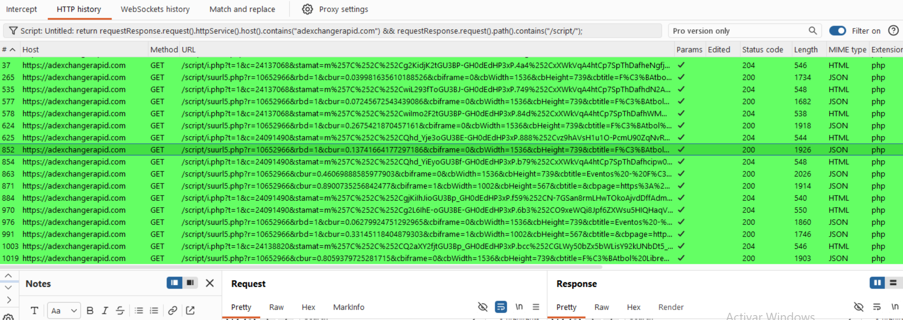
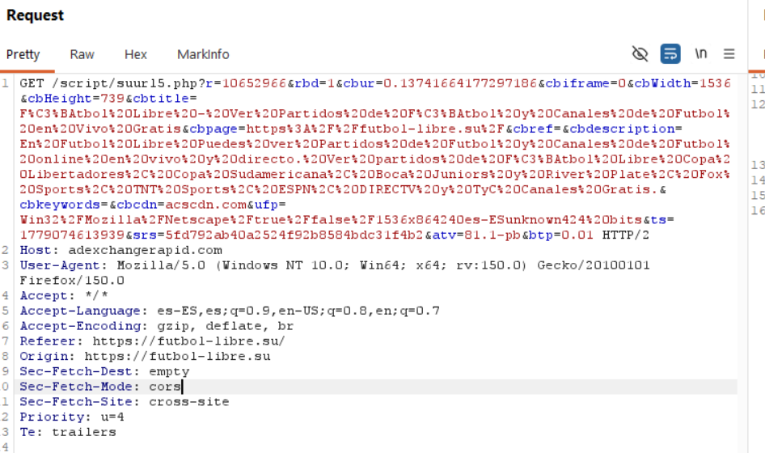
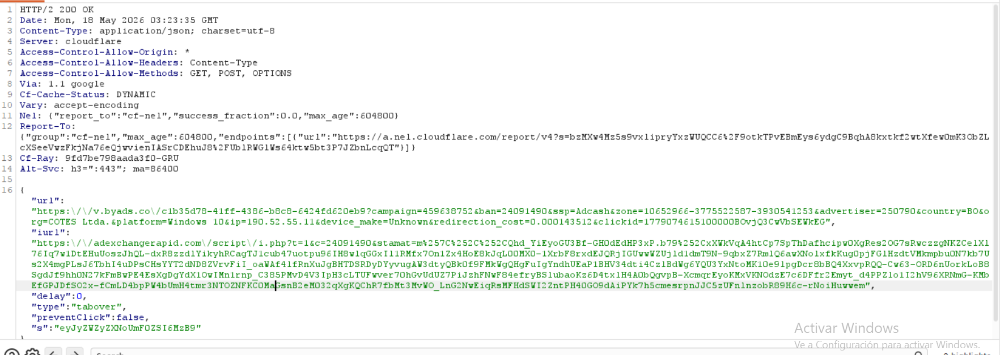

## H-02 Delegación de lógica de ejecución a infraestructura third-party

### Evidencia observada

Durante la sesión experimental se observó que el sitio analizado delega lógica operativa a infraestructura third-party perteneciente al dominio:

```text
adexchangerapid.com
```

La interacción observada no corresponde únicamente a carga pasiva de recursos, sino a intercambio activo de información contextual del navegador con posterior recepción de instrucciones operativas desde infraestructura externa.

Endpoints observados:

```http
/script/suurl5.php
/script/i.php
```

---

### Evidencia técnica

Request observado:

```http
GET /script/suurl5.php?r=10652966&rbd=1&cbur=0.13741664177297186&cbiframe=0&cbWidth=1536&cbHeight=739&cbtitle=...&cbpage=https://futbol-libre.su/&cbdescription=...&cbkeywords=&cbcdn=acscdn.com&ufp=Win32/Mozilla/Netscape/true/false/1536x864240es-ESunknown424 bits&ts=1779074613939&srs=5fd792ab40a2524f92b8584bdc31f4b2&atv=81.1-pb&btp=0.01 HTTP/2
Host: adexchangerapid.com
Referer: https://futbol-libre.su/
Origin: https://futbol-libre.su
Sec-Fetch-Site: cross-site
```

Se observa transmisión de:

**Contexto del documento**
- URL visitada (`cbpage`)
- título del documento (`cbtitle`)
- descripción del contenido (`cbdescription`)

**Atributos técnicos**
- dimensiones del viewport (`cbWidth`, `cbHeight`)
- contexto iframe (`cbiframe`)
- fingerprint técnico agregado (`ufp`)

**Persistencia**
- identificador correlacionable (`srs`)

---

### Respuesta observada

```http
HTTP/2 200 OK
Content-Type: application/json
Access-Control-Allow-Origin: *
```

Body:

```json
{
  "url": "https://v.byads.co/...",
  "iurl": "https://adexchangerapid.com/script/i.php?...",
  "delay": 0,
  "type": "tabover",
  "preventClick": false
}
```

---

### Evidencia visual







---

### Interpretación técnica

La evidencia demuestra que la infraestructura externa no actúa únicamente como proveedor pasivo de contenido publicitario, sino como componente con capacidad de decisión operativa dentro del flujo de navegación.

#### Delegación de lógica operativa

La respuesta JSON observada devuelve parámetros explícitos de comportamiento:

```text
type=tabover
delay=0
preventClick=false
```

Esto indica que decisiones sobre comportamiento del navegador son obtenidas dinámicamente desde infraestructura third-party.

---

#### Transferencia de contexto sensible del navegador

Previo a la respuesta, el cliente transmite:

- metadata del documento visitado
- contexto técnico del navegador
- identificadores correlacionables
- fingerprint técnico agregado

lo que permite que infraestructura externa tome decisiones basadas en el contexto del usuario.

---

#### Ejecución cross-site permitida

La presencia de:

```http
Access-Control-Allow-Origin: *
```

junto con:

```http
Sec-Fetch-Site: cross-site
```

confirma interoperabilidad explícita entre el sitio analizado y servicios externos.

---

### Impacto observado

**Riesgo de dependencia operativa third-party**
- comportamiento del navegador condicionado por infraestructura externa

**Riesgo de exposición contextual**
- transferencia de metadata del documento
- exposición de atributos técnicos del entorno cliente

**Riesgo de correlación inter-servicio**
- reutilización de identificadores entre componentes del ecosistema publicitario

---

### Alcance metodológico

Este hallazgo documenta delegación de lógica de ejecución hacia infraestructura third-party.

La materialización de navegación inducida derivada de esta configuración se documenta separadamente en el hallazgo H-03.