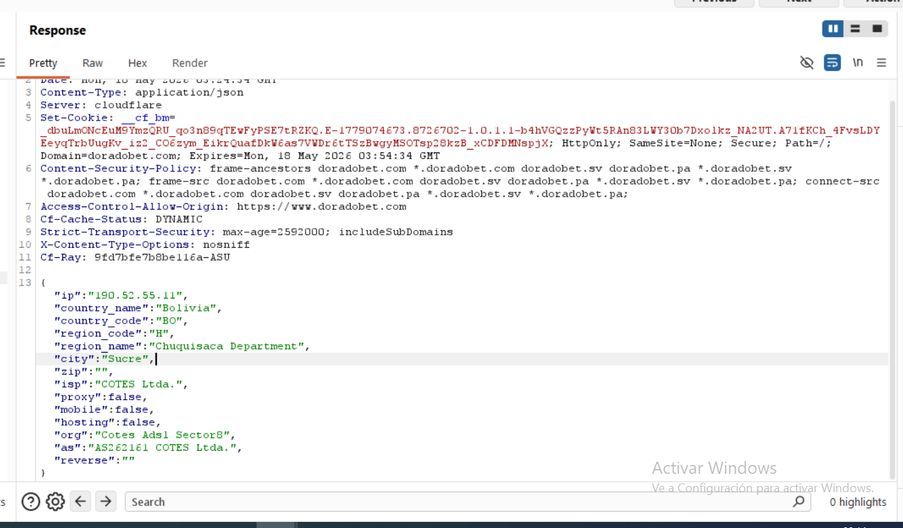

# H-04 Perfilado contextual del cliente mediante geolocalización de red

## Evidencia observada

Tras la navegación inducida hacia infraestructura comercial externa, se observó que el dominio de destino ejecutó una consulta que devolvió información contextual detallada asociada a la conexión del cliente.

La respuesta incluyó atributos derivados de la IP pública del usuario y características de la red de origen, evidenciando enriquecimiento contextual del cliente por parte del servicio externo.

---

## Evidencia técnica

Response observado:

```http
HTTP/2 200 OK
Date: Mon, 18 May 2026 03:24:34 GMT
Content-Type: application/json
Server: cloudflare
Set-Cookie: __cf_bm=_dbuLmONcEuM9YmzQRU_qo3n89qTEwFyPSE7tRZKQ.E...
Strict-Transport-Security: max-age=2592000; includeSubDomains
X-Content-Type-Options: nosniff
```

Payload observado:

```json
{
  "ip":"190.52.55.11",
  "country_name":"Bolivia",
  "country_code":"BO",
  "region_code":"H",
  "region_name":"Chuquisaca Department",
  "city":"Sucre",
  "zip":"",
  "isp":"COTES Ltda.",
  "proxy":false,
  "mobile":false,
  "hosting":false,
  "org":"Cotes Adsl Sector8",
  "as":"AS262161 COTES Ltda.",
  "reverse":""
}
```

---

## Evidencia visual en log 902



---

## Interpretación técnica

La evidencia muestra que el servicio externo ejecutó enriquecimiento contextual del cliente basado en atributos observables desde la conexión HTTP.

El payload devuelto incorpora información derivada de red, incluyendo:

- dirección IP pública
- país
- región
- ciudad
- proveedor de conectividad (ISP)
- sistema autónomo (ASN)
- clasificación operativa del origen (`proxy`, `mobile`, `hosting`)

Este comportamiento es consistente con mecanismos de:

- geolocalización operativa
- segmentación comercial
- personalización regional de contenido
- controles antifraude o validación de reputación del origen

Debe señalarse que la exposición de la dirección IP pública es inherente al modelo de comunicación HTTP; sin embargo, el enriquecimiento contextual observado incrementa el nivel de perfilado técnico realizado por el servicio externo.

La presencia de la cookie:

```http
Set-Cookie: __cf_bm=...
```

corresponde a mecanismos de protección de infraestructura administrados por Cloudflare (bot management / anti-automation), por lo que no constituye por sí misma evidencia de tracking comercial.

No obstante, el payload JSON observado sí evidencia perfilado contextual explícito del cliente.

Considerando que el acceso a este dominio ocurrió tras navegación inducida previamente observada desde infraestructura publicitaria third-party, este evento amplía la superficie de exposición del usuario hacia servicios externos no inicialmente seleccionados.

---

## Impacto observado

- exposición contextual de atributos de red del cliente
- perfilado geográfico basado en IP pública
- identificación del proveedor de conectividad
- clasificación operativa del origen de conexión
- ampliación de exposición hacia infraestructura third-party